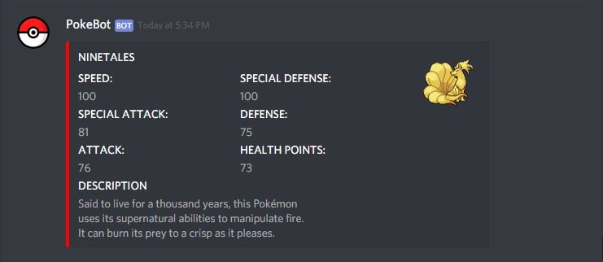
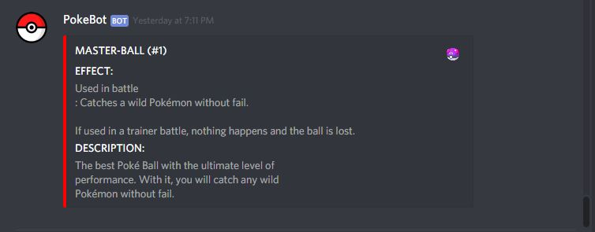

# PokeBot-Discord
A simple pokedex Bot for discord made with discordjs that uses the pokeAPI

# Usage
**Command:** !pokemon (id or name)
             !item (id or name)

# Examples  

**!pokemon Command:**  

  

**!Pokemon Output**  

---

**!item command**  

**!item output**  

